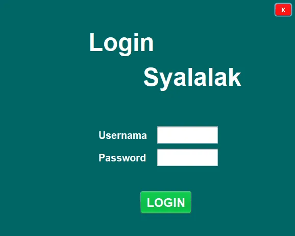
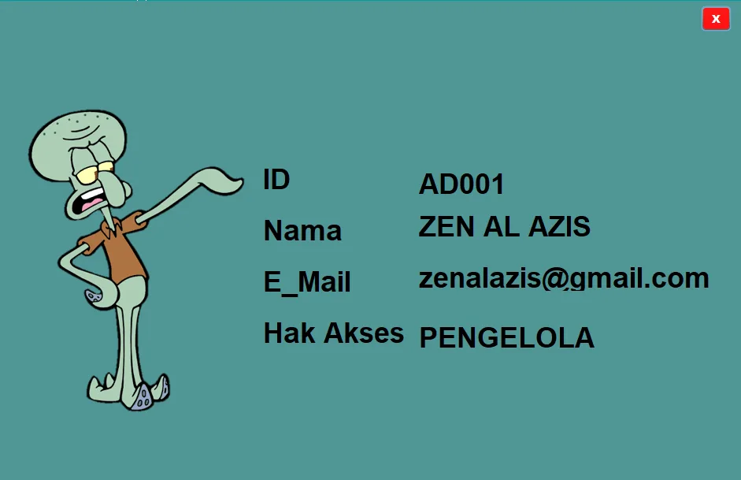
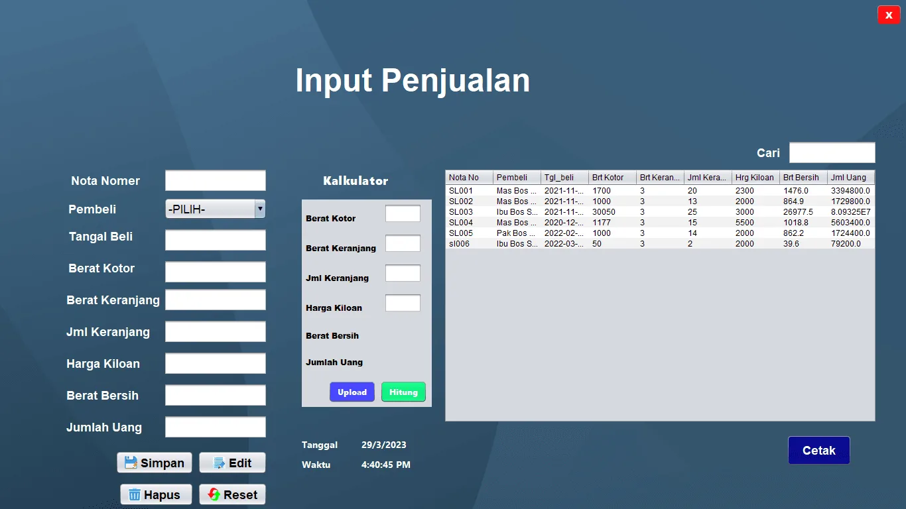
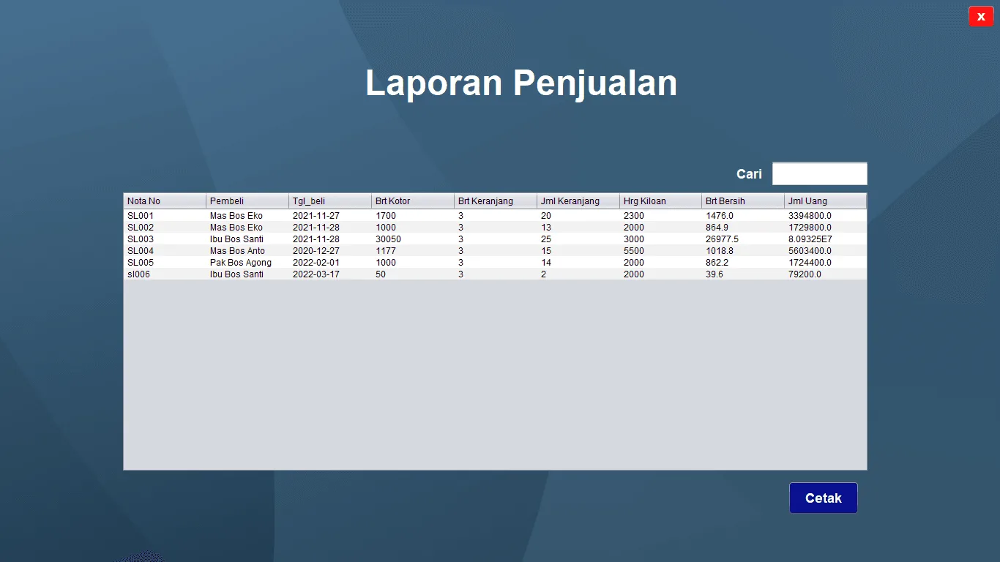
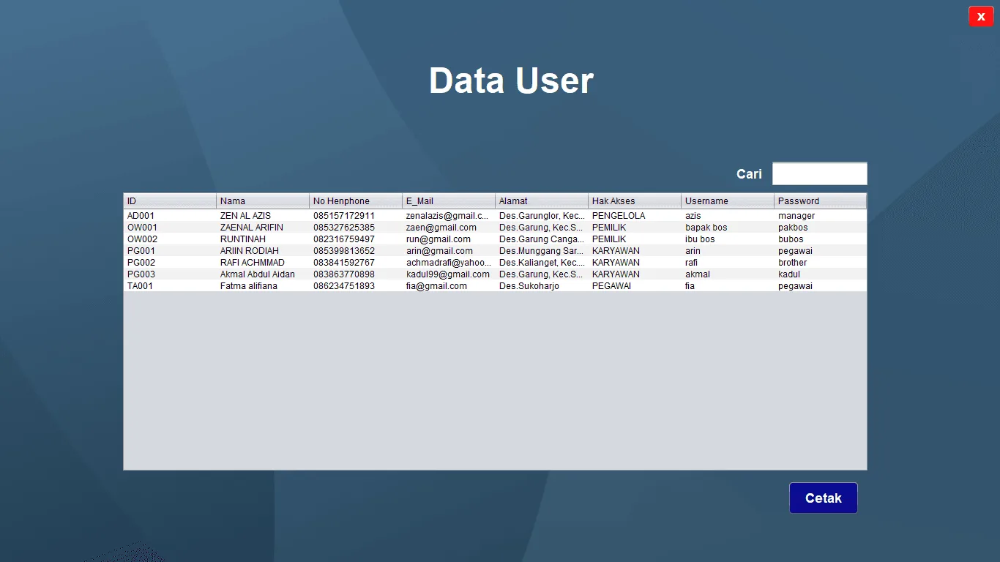
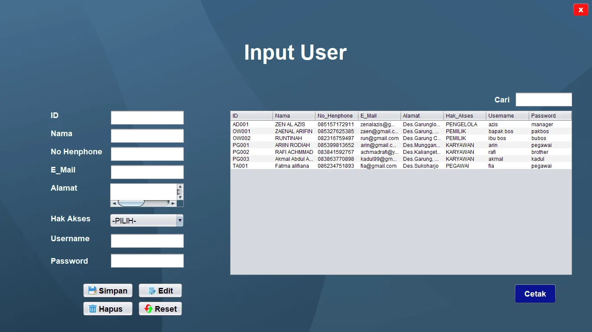
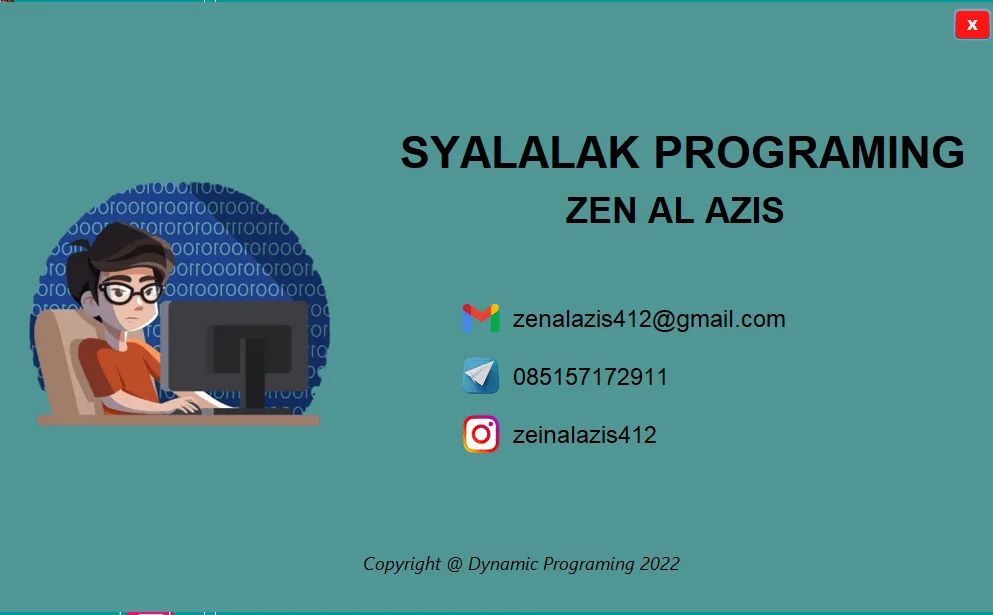

<h1 align="center">
  🛒 Syalalak V.1 — Software Management Panen & Penjualan Salak
</h1>

  <b>Sistem Informasi Desktop Berbasis Java & MySQL untuk Efisiensi Pencatatan Bisnis Hasil Panen Salak</b>

  
  
  

---

## 📌 Mengapa Syalalak V.1?

Proses pencatatan hasil panen dan transaksi penjualan salak secara manual sering menyebabkan **selisih data, perhitungan yang lambat, dan minimnya rekapitulasi performa bisnis**.

**Syalalak V.1** hadir sebagai solusi sistematis yang memodernisasi pencatatan operasional harian. Telah teruji dan diimplementasikan secara riil untuk membantu rantai distribusi petani dan pengepul buah salak di **Desa Garunglor, Kecamatan Sukoharjo, Kabupaten Wonosobo**.

---

## 📸 Antarmuka & Fitur Unggulan (Showcase)

### 🔑 1. Sistem Keamanan & Autentikasi Pengguna
Memastikan data transaksi aman dengan pemisahan hak akses otomatis (Karyawan, Manager, Owner).

  

  

---

### 🛒 2. Transaksi Penjualan & Kalkulator Panen Otomatis
Dipercaya mempercepat input data transaksi harian di lokasi penimbangan dan meminimalkan kesalahan hitung.

  

---

### 📊 3. Rekapitulasi & Laporan Penjualan (Executive View)
Memudahkan pemilik usaha memantau tren penjualan, evaluasi hasil panen bulanan/tahunan, dan audit finansial.

  

---

### 👥 4. Manajemen Pengguna & Sistem Akses (Multi-Role)
Fleksibilitas mengelola data pengguna serta mengatur hak akses operasional sesuai struktur organisasi bisnis.

  

  

---

### ℹ️ 5. Tentang Pengembang (About Us)

  

---

## ✨ Fitur Kunci Sistem

* **Otomatisasi Perhitungan Transaksi**: Kalkulator khusus panen terintegrasi langsung dengan database nominal.
* **Multi-Role Privilege System**:
  * 🧑‍💻 **Karyawan**: Operator input data panen & penggunaan kalkulator.
  * 👔 **Manager**: Pengelola data master, sistem akses, dan pemantau transaksi harian.
  * 👨‍💼 **Owner / Bos**: Menerima laporan rekapitulasi akhir dan evaluasi produktivitas usaha.
* **Monitoring Hasil Panen**: Melacak riwayat naik-turunnya volume panen untuk membantu perencanaan pasokan.

---

## 📄 Proposal Penawaran Produk

Ingin mengetahui analisis kebutuhan sistem, alur implementasi, serta skema lisensi aplikasi ini? Silakan unduh dokumen proposal penawaran resmi:

👉 **[Download Proposal Penawaran Syalalak V.1 (PDF)](docs/Proposal-Penawaran-Syalalak-V1.pdf)**

---

## 💼 Pemesanan & Dapatkan Full Source Code

> 💡 **Catatan**: Repositori ini bersifat **Showcase & Portofolio**. Kode program utama (*Full Source Code*) tersimpan di repositori privat.

Jika Anda merupakan **pemilik usaha/pengepul**, **instansi/kelompok tani**, atau **pengembang** yang tertarik untuk:
1. Membeli/mengakses **Full Source Code lengkap (Java NetBeans + Database MySQL)**.
2. Menggunakan & mengimplementasikan aplikasi ini di lokasi usaha Anda.
3. Mengajukan kustomisasi (*custom feature*) sesuai alur bisnis spesifik Anda.

Silakan hubungi pengembang secara langsung melalui tautan di bawah ini:

* 🌐 **Website Resmi**: [zenalazis.my.id](https://zenalazis.my.id/download-aplikasi-jual-beli-salak-menggunakan-java/)
* 💼 **LinkedIn**: [Zen Al Azis](https://linkedin.com/in/zenalazis)
* 📸 **Instagram**: [@zenalazis.dev](https://www.instagram.com/zenalazis.dev/)
* 💬 **WhatsApp**: [Hubungi Langsung via WhatsApp](https://wasap.at/8ddHoG)
* ✉️ **Email Direct**: [azisgames412@gmail.com](mailto:azisgames412@gmail.com)

---

  <i>Developed with ❤️ by <b>Zen Al Azis</b></i>

